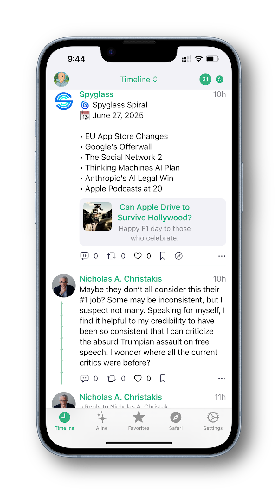

# Limit - Bluesky Client for iOS

A modern, native iOS client for the Bluesky social network built with SwiftUI and the latest iOS technologies.

## 📱 Screenshots

<!-- Add your screenshots here -->
<!-- 
To add screenshots:
1. Take screenshots in Xcode simulator (Cmd+Shift+4)
2. Save them to screenshots/ folder
3. Update these placeholders with actual image paths
-->

 

*Main timeline and lists with posts and interactions*

  
*User profile with posts and following*

  
*Save posts and links locally*

## ✨ Features

- **Modern Timeline**: Infinite scrolling timeline with real-time updates
- **Lists & Feeds Support**: Browse your lists and custom feeds seamlessly
- **Smart Caching**: Intelligent post caching for offline reading
- **Thread View**: Full conversation threading support
- **Profile Management**: View and manage user profiles
- **Favorites System**: Save posts and URLs for later
- **Dark Mode**: Full dark mode support
- **Native iOS Design**: Built with SwiftUI following iOS design guidelines
- **Bluesky Integration**: Full AT Protocol support via ATProtocol library

## 🚀 Getting Started

### Prerequisites

- Xcode 15.0 or later
- iOS 17.0 or later
- macOS 14.0 or later (for development)
- Apple Developer Account (for device testing)

### Installation

1. **Clone the repository**
   ```bash
   git clone https://github.com/zdenekindra/limit.git
   cd limit
   ```

2. **Open in Xcode**
   ```bash
   open Limit.xcodeproj
   ```

3. **Configure Bundle ID** (Optional)
   - Open project settings in Xcode
   - Change Bundle Identifier to your own (e.g., `com.yourname.limit`)
   - Update Development Team in Signing & Capabilities

4. **Build and Run**
   - Select your target device or simulator
   - Press `Cmd+R` to build and run

### First Run

1. Launch the app
2. Enter your Bluesky handle (e.g., `@yourname.bsky.social`)
3. Enter your App Password (not your main password)
4. Tap "Login" to start using the app

## 🛠️ Technology Stack

- **SwiftUI**: Modern declarative UI framework
- **SwiftData**: Local data persistence
- **ATProtocol**: Official Bluesky AT Protocol library
- **KeychainSwift**: Secure credential storage
- **SDWebImage**: Efficient image loading and caching

## 📁 Project Structure

```
Limit/
├── Views/                 # SwiftUI views
│   ├── Timeline/         # Timeline-related views
│   ├── PostUI/           # Post display components
│   ├── ActorUI/          # Profile and user views
│   └── TabUI/            # Tab bar views
├── Model/                # Data models
├── Network/              # Network layer and API client
├── Utils/                # Utilities and helpers
├── DesignSystem/         # Colors and design tokens
└── Assets.xcassets/      # App icons and images
```

## 🔧 Configuration

### Bundle ID
The app uses a default bundle identifier. For personal use, update it in Xcode:
- Target → General → Identity → Bundle Identifier
- Recommended: `com.yourname.limit`

### Development Team
For testing on physical devices:
- Target → Signing & Capabilities → Development Team
- Select your Apple Developer account

## 🤝 Contributing

We welcome contributions! Please see our [Contributing Guidelines](CONTRIBUTING.md) for details.

### Development Setup
1. Fork the repository
2. Create a feature branch
3. Make your changes
4. Add tests if applicable
5. Submit a pull request

## 📄 License

This project is licensed under the MIT License - see the [LICENSE](LICENSE) file for details.

## 🙏 Acknowledgments

- [Bluesky](https://bsky.app) for the amazing social platform
- [ATProtocol](https://atproto.com) for the open protocol
- [SwiftUI](https://developer.apple.com/xcode/swiftui/) community for inspiration

## 📞 Support

- **Issues**: [GitHub Issues](https://github.com/zdenekindra/limit/issues)
- **Discussions**: [GitHub Discussions](https://github.com/zdenekindra/limit/discussions)
- **Email**: [Your email here]

## 🔄 Version History

- **v1.1.0** - Lists & Feeds Support
  - Browse user-created lists and custom feeds
  - Unified timeline picker for Timeline/Lists/Feeds
  - Position management for lists and feeds
  - Seamless content switching
  
- **v1.0.0** - Initial release
  - Basic timeline functionality
  - User authentication
  - Post interactions
  - Profile management

---

**Note**: This is an unofficial Bluesky client. Bluesky and AT Protocol are trademarks of their respective owners. 